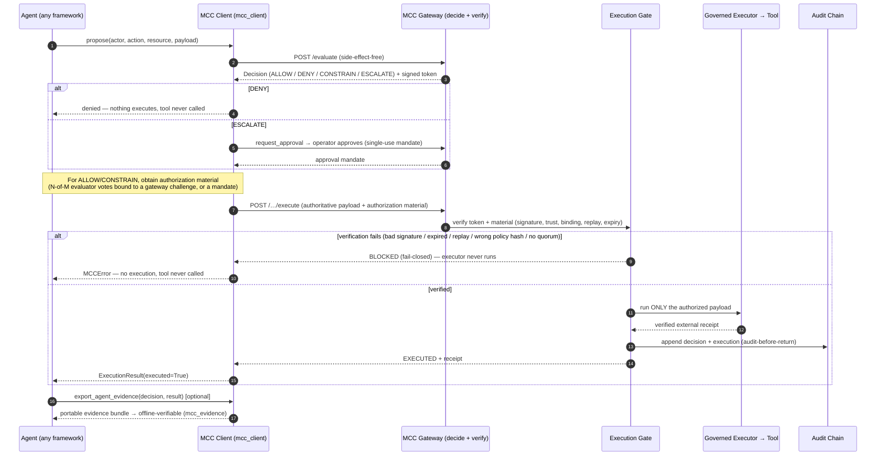

# MCC-Core Official Integration Contract

The stable, framework-neutral contract for integrating any external AI agent or
system with MCC-Core. It is deliberately minimal: an integration produces a
**proposal** and hands it to the supported client; MCC-Core does everything that
carries authority. No framework-specific abstraction appears in the public
surface, so VoltAgent, LangGraph, CrewAI, OpenAI Agents, AutoGen, Semantic Kernel,
ADK, or a hand-written loop all integrate the same way.

> The model proposes. MCC-Core decides. The gate enforces. The audit chain records.
>
> **Identity is not authority. Proposal is not permission. Execution always
> requires verified authorization.**

This document lets you integrate without reading MCC-Core internals. The canonical
implementation is already in the repository — do not reimplement it:

- **Integration client (transport + contract):** `mcc_client` (`sdk/python/`).
- **Reference governed agent (canonical example):** `examples/reference_governed_agent/`.
- **Portable audit evidence:** `mcc_evidence` (see `docs/GOVERNANCE_EVIDENCE_BUNDLE.md`).

## Canonical execution flow

```
Agent
  → Action Proposal            (framework/reasoning produces intent)
  → MCC Client                 (mcc_client.MCCClient, the only integration surface)
  → Governance Decision        (POST /evaluate — ALLOW / DENY / CONSTRAIN / ESCALATE)
  → Execution Gate             (verifies token + authorization material, fail-closed)
  → Authorized Tool Execution  (governed executor — the ONLY trusted execution path)
  → Immutable Audit Evidence   (hash-chain audit; portable evidence bundle)
```

## The five contract stages

The integration surface separates exactly five concerns. Only the first is the
integrator's responsibility; the rest belong to MCC-Core.

| Stage | Who | Surface | Guarantee |
|-------|-----|---------|-----------|
| **Proposal** | Integrator | build an action (`actor_id`, `action`, `resource`, `payload`) | Reasoning is not authority; a proposal executes nothing. |
| **Decision** | MCC-Core | `client.evaluate(...) -> Decision` | Side-effect-free verdict: ALLOW / DENY / CONSTRAIN / ESCALATE. |
| **Verification** | MCC-Core | inside the gateway/gate | Ed25519 token, issuer trust, policy/action/payload binding, replay protection, authority + scope + identity. |
| **Execution** | MCC-Core | `client.execute(decision, authorization)` | Runs **only** the decision's authoritative payload through the one governed executor, after the gate verifies authorization material. |
| **Audit** | MCC-Core | append-only hash-chain; `client.verify_audit_chain()`; `mcc_evidence` bundle | Every decision and execution is recorded and independently verifiable offline. |

## Reference sequence diagram



## Integration steps

1. **Point the client at your gateway.**
   ```python
   from mcc_client import MCCClient
   client = MCCClient("https://gateway.example", api_key="…", operator_key="…")
   ```
2. **Propose** — turn your agent's intent into an action and evaluate it. This is
   side-effect-free; a verdict is not execution.
   ```python
   decision = client.evaluate(actor_id="agent/x", action="send_notification",
                              resource="notifications", payload={...})
   ```
3. **Dispatch on the verdict.** `DENY` → stop (the tool is never called).
   `ESCALATE` → `client.request_approval(decision)` then an operator approves.
   `ALLOW` / `CONSTRAIN` → proceed to execute the **authoritative** payload
   (`decision.authorized_payload`; the server-clamped body for CONSTRAIN).
4. **Obtain authorization material and execute through the governed path.** MCC
   does not hand out a bearer token; a separate authority (an evaluator
   consensus, or a signed/approved mandate) produces material the gate verifies.
   ```python
   result = client.execute(decision, authorization)   # governed executor only
   ```
5. **Audit.** Verify the chain (`client.verify_audit_chain()`) and/or export a
   portable evidence bundle:
   ```python
   from examples.reference_governed_agent import export_agent_evidence
   export_agent_evidence(decision, result, "out/bundle")   # offline-verifiable
   ```

The reference agent (`ReferenceGovernedAgent`) wires steps 1–5 together with an
injected reasoning provider, operator, and authorizer; copy it as your starting
point.

## Trust boundaries

- **The agent/integration is untrusted for authority.** It proposes and orchestrates;
  it holds no signing key and has **no direct execution route** to any tool or
  external service. A static test (`test_reference_governed_agent.py::
  test_agent_has_no_direct_external_execution_route`) enforces this.
- **The MCC Gateway is the sole decision authority** and the sole issuer of signed
  decision tokens.
- **The Execution Gate + governed executor are the only trusted execution path.**
  There is exactly one; integrations never add a second.
- **Authorization material** (consensus votes / mandates) comes from an
  independent authority and is always verified server-side before execution.
- **The audit chain** is append-only and independently verifiable; evidence
  bundles are verifiable offline against a trusted issuer key.

## Failure modes (all fail-closed)

For every case below, **no tool executes, no external service is called, and no
result is ever silently treated as success** — verified by
`tests/test_integration_contract.py` and `tests/test_reference_governed_agent.py`.

| Failure | Contract behavior |
|---------|-------------------|
| `DENY` verdict | No execution; tool never called. |
| `ESCALATE` without approval | No execution until a valid single-use approval. |
| Invalid signature (bad votes) | Gate rejects; `MCCError`; executor never runs. |
| Expired authorization | Gate rejects expired material; `MCCError`. |
| Replay attempt | Single-use challenge/nonce; a second execute is blocked; executed at most once. |
| Invalid policy hash | Binding mismatch; gate rejects; `MCCError`. |
| No / insufficient quorum | Below-threshold consensus is blocked. |
| Gateway unavailable | Transport failure surfaces as a typed `MCCError` (never assumed success). |
| Unauthorized direct execution | Impossible — the agent has no execution route; the executor refuses unsigned calls. |
| Malformed / ambiguous execution response | `MCCAmbiguousExecutionError` — outcome unknown, never assumed executed. |

## Security guarantees (unchanged by integration)

Integrating through this contract changes none of MCC-Core's guarantees:

- Ed25519-signed decision tokens; issuer-trust verification.
- Replay protection (single-use nonce / challenge).
- Authority, scope, identity, and policy binding verified at the gate.
- Fail-closed by default: no verified authorization ⇒ no execution.
- Audit-before-actuation; append-only hash-chain; offline-verifiable evidence.
- The client is a client: it makes no local decision, signs nothing, and cannot
  bypass the gate.

## What this contract is not

It is not a new transport, gateway, policy engine, or execution path, and it adds
no cryptography or governance semantics. Framework-specific adapters (MCP,
LangGraph, CrewAI, OpenAI Agents, AutoGen, Semantic Kernel, ADK) are **out of
scope** here — each is a future adapter that produces a proposal and hands it to
this same `mcc_client` boundary. The existing production execution path remains
the only trusted execution path.
