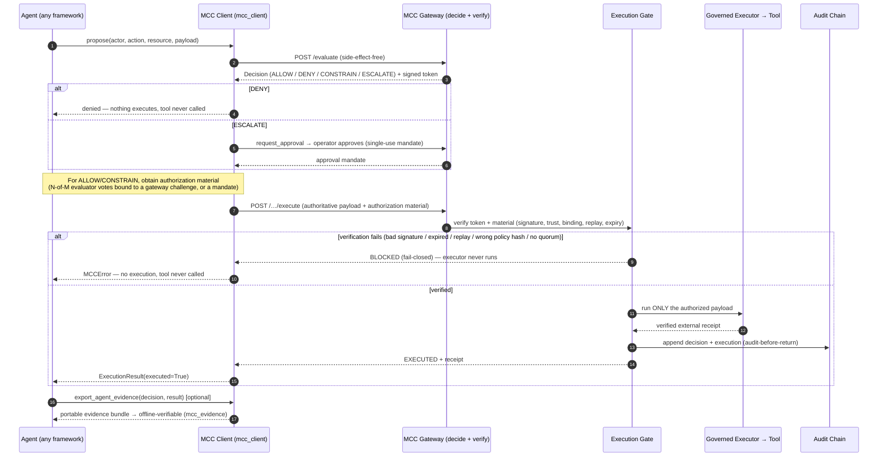

# MCC-Core Official Integration Contract

**Status: Normative.** Contract version **1.0** (`MAJOR.MINOR`). Identifier
`mcc-integration-contract`.

The stable, framework-neutral, transport-neutral contract for integrating any
external AI agent or system with MCC-Core. It is deliberately minimal: an
integration produces a **proposal** and hands it to the supported client;
MCC-Core does everything that carries authority. No framework-specific
abstraction appears in the normative surface, so VoltAgent, LangGraph, CrewAI,
OpenAI Agents, AutoGen, Semantic Kernel, ADK, or a hand-written loop all integrate
the same way.

> The model proposes. MCC-Core decides. The gate enforces. The audit chain records.
>
> **Identity is not authority. Proposal is not permission. Execution always
> requires verified authorization.**

## The normative model (specification, artifacts, adapters)

> **The Integration Contract is the normative specification. The existing
> `mcc_client` models are the canonical implementation artifacts of that
> specification. Adapter implementations, including VoltAgent, demonstrate
> conformance but do not define the contract.**

This ties three things into one non-contradictory model:

- **Specification (normative):** this document plus the machine-readable
  identifiers in `mcc_client.contract` (contract version, error taxonomy,
  conformance manifest). This is what an adapter conforms *to*.
- **Canonical implementation artifacts:** the models the SDK already ships —
  `mcc_client.Verdict`, `mcc_client.Decision`, `mcc_client.ExecutionResult`, and
  the authorization artifacts (`ConsensusAuthorization`, `MandateAuthorization`,
  `ApprovalAuthorization`). The contract **reuses** these; it defines **no parallel
  wire models**. Duplicating them would create semantic drift and is forbidden. The
  Canonical Governance Protocol (PR #49, `mcc_protocol`) adds the request object
  `CanonicalProposal` and the response envelope `GovernanceDecision`; these are
  **compatible evolutions, not a parallel hierarchy** — `CanonicalProposal` is the
  additive request type the SDK previously lacked, and `GovernanceDecision`
  **wraps** (never replaces) `mcc_client.Decision` and its Decision Token. There
  remains exactly one normative wire contract. See
  `docs/CANONICAL_GOVERNANCE_PROTOCOL.md`.
- **Adapters (conforming, non-normative):** VoltAgent is a *proven reference
  integration* — it demonstrated that MCC-Core can be governed inside a real agent
  framework. It is **not** the reference definition. Every current and future
  adapter, VoltAgent included, conforms to this same contract; no adapter defines
  it.

The canonical implementation is already in the repository — do not reimplement it:

- **Normative layer (versions, error taxonomy, manifest):** `mcc_client.contract`.
- **Integration client (transport + models):** `mcc_client` (`sdk/python/`).
- **Reference governed agent (canonical example):** `examples/reference_governed_agent/`.
- **Portable audit evidence:** `mcc_evidence` (see `docs/GOVERNANCE_EVIDENCE_BUNDLE.md`).
- **Golden vectors (offline, framework-neutral):** `tests/contract_vectors/`.
- **Conformance manifest (for PR #44):** `docs/contract/conformance-manifest.json`,
  produced by `mcc_client.contract.conformance_manifest()`.

## Normative language

The key words **MUST**, **MUST NOT**, **REQUIRED**, **SHALL**, **SHALL NOT**,
**SHOULD**, **SHOULD NOT**, **RECOMMENDED**, **MAY**, and **OPTIONAL** are to be
interpreted as in RFC 2119. Normative requirements appear in the matrices and the
responsibility/failure/negative-guarantee sections. Sequence diagrams, code
snippets, and framework names are **informative** unless a sentence says
otherwise.

### Terminology

| Term | Meaning |
|------|---------|
| **Proposal** | An integrator-built action (`actor_id`, `action`, `resource`, `payload`). Carries no authority. |
| **Decision** | MCC-Core's side-effect-free verdict for a proposal (`mcc_client.Decision`). |
| **Verdict** | One of `ALLOW`, `DENY`, `ESCALATE`, `CONSTRAIN` (`mcc_client.Verdict`). |
| **Authorization material** | An artifact an *independent* authority produces and the Gate verifies: N-of-M evaluator votes bound to a gateway challenge, or a signed/approved mandate. |
| **Gate** | The single trusted component that verifies authorization and admits execution. |
| **Governed executor** | The one trusted execution path; the only thing that performs the side effect. |
| **Authoritative payload** | The body a verdict authorizes: the original payload for `ALLOW`, the server-clamped body for `CONSTRAIN` (`Decision.authorized_payload`). |
| **Adapter** | Code that turns a framework's intent into a proposal and hands it to the contract. Non-normative; conforms to this document. |

## Canonical execution flow (informative)

```
Agent
  → Action Proposal            (framework/reasoning produces intent)
  → MCC Client                 (mcc_client.MCCClient, the only integration surface)
  → Governance Decision        (POST /evaluate — ALLOW / DENY / CONSTRAIN / ESCALATE)
  → Execution Gate             (verifies token + authorization material, fail-closed)
  → Authorized Tool Execution  (governed executor — the ONLY trusted execution path)
  → Immutable Audit Evidence   (hash-chain audit; portable evidence bundle)
```

## The five contract stages

The integration surface separates exactly five concerns. Only the first is the
integrator's responsibility; the rest belong to MCC-Core.

| Stage | Who | Surface | Guarantee |
|-------|-----|---------|-----------|
| **Proposal** | Integrator | build an action (`actor_id`, `action`, `resource`, `payload`) | Reasoning is not authority; a proposal executes nothing. |
| **Decision** | MCC-Core | `client.evaluate(...) -> Decision` | Side-effect-free verdict: ALLOW / DENY / CONSTRAIN / ESCALATE. |
| **Verification** | MCC-Core | inside the gateway/gate | Ed25519 token, issuer trust, policy/action/payload binding, replay protection, authority + scope + identity. |
| **Execution** | MCC-Core | `client.execute(decision, authorization)` | Runs **only** the decision's authoritative payload through the one governed executor, after the gate verifies authorization material. |
| **Audit** | MCC-Core | append-only hash-chain; `client.verify_audit_chain()`; `mcc_evidence` bundle | Every decision and execution is recorded and independently verifiable offline. |

## Reference sequence diagram (informative)



## Integration steps (informative)

1. **Point the client at your gateway.**
   ```python
   from mcc_client import MCCClient
   client = MCCClient("https://gateway.example", api_key="…", operator_key="…")
   ```
2. **Propose** — turn your agent's intent into an action and evaluate it. This is
   side-effect-free; a verdict is not execution.
   ```python
   decision = client.evaluate(actor_id="agent/x", action="send_notification",
                              resource="notifications", payload={...})
   ```
3. **Dispatch on the verdict.** `DENY` → stop (the tool is never called).
   `ESCALATE` → `client.request_approval(decision)` then an operator approves.
   `ALLOW` / `CONSTRAIN` → proceed to execute the **authoritative** payload
   (`decision.authorized_payload`; the server-clamped body for CONSTRAIN).
4. **Obtain authorization material and execute through the governed path.** MCC
   does not hand out a bearer token; a separate authority (an evaluator
   consensus, or a signed/approved mandate) produces material the gate verifies.
   ```python
   result = client.execute(decision, authorization)   # governed executor only
   ```
5. **Audit.** Verify the chain (`client.verify_audit_chain()`) and/or export a
   portable evidence bundle:
   ```python
   from examples.reference_governed_agent import export_agent_evidence
   export_agent_evidence(decision, result, "out/bundle")   # offline-verifiable
   ```

The reference agent (`ReferenceGovernedAgent`) wires steps 1–5 together with an
injected reasoning provider, operator, and authorizer; copy it as your starting
point.

## Contract versioning and compatibility (normative)

- The contract version is `MAJOR.MINOR`; this build is **1.0**
  (`mcc_client.contract.CONTRACT_VERSION`).
- The **contract version and the package/distribution version are separate
  concepts.** A patch-level release of `mcc-core` / `mcc_client` MUST NOT silently
  redefine contract semantics.
- A **MAJOR** change is incompatible; a **MINOR** change is backward-compatible and
  additive. Optional additive fields MUST NOT change mandatory semantics.
- An **unknown MAJOR** version MUST fail closed. A caller MUST NOT silently
  downgrade to an unsupported version.
- An adapter MUST NOT claim a higher supported version than it implements.
- Compatibility is decided deterministically by
  `mcc_client.contract.check_version_compatibility(version)`, which returns a
  `VersionCompatibility` whose `compatible` flag is the only field that gates
  behavior; when `False`, `error_code` is a blocking code
  (`CONTRACT_VERSION_MALFORMED` or `CONTRACT_VERSION_UNSUPPORTED`).

| Declared | This build (1.0) | Result |
|----------|------------------|--------|
| `1.0` | supported major, same minor | compatible |
| `1.7` | supported major, newer minor | compatible (`newer_minor=True`; unknown additive fields are ignored, never trusted to weaken a requirement) |
| `2.0` | unknown major | **fail closed** — `CONTRACT_VERSION_UNSUPPORTED` |
| `1`, `1.x`, `""` | malformed | **fail closed** — `CONTRACT_VERSION_MALFORMED` |

## Lifecycle and state transitions (normative)

An integration request moves through these logical states. Names align with the
runtime; the rules are what bind.

| State | Meaning | Allowed next |
|-------|---------|--------------|
| `CREATED` | proposal built | `VALIDATED`, `FAILED` |
| `VALIDATED` | contract-shape valid (not authorized) | `SUBMITTED`, `FAILED` |
| `SUBMITTED` | sent to `/evaluate` | `DECIDED`, `FAILED` |
| `DECIDED` | verdict returned | `VERIFIED`, `ESCALATED`, `REFUSED` |
| `ESCALATED` | ESCALATE pending approval | `VERIFIED` (after single-use approval), `REFUSED` |
| `VERIFIED` | Gate verified token + material | `ENFORCED`, `REFUSED` |
| `ENFORCED` | audit written before actuation | `EXECUTING`, `REFUSED` |
| `EXECUTING` | governed executor running | `COMPLETED`, `FAILED` |
| `COMPLETED` | EXECUTED + receipt (terminal) | — |
| `REFUSED` | fail-closed block (terminal) | — |
| `FAILED` | error/ambiguous (terminal) | — |

Mandatory rules (all fail-closed):

- Execution MUST NOT precede decision **verification**.
- Execution MUST NOT proceed on `DENY`, nor on unresolved `ESCALATE`.
- `CONSTRAIN` execution MUST run only the authoritative (clamped) payload.
- Invalid or expired authorization MUST fail closed (`REFUSED`).
- Audit prerequisites MUST be satisfied before actuation (audit-before-enforce).
- Retries MUST NOT create unauthorized duplicate execution: the challenge/nonce is
  single-use, so a replay is `REFUSED` and the action executes **at most once**.
- A transport failure after submit is `FAILED` as *ambiguous*
  (`MCCAmbiguousExecutionError`) — it MUST be reconciled via the audit chain, never
  assumed executed and never blindly retried.

## Stable error taxonomy (normative)

Error **codes** are stable machine-readable strings
(`mcc_client.contract.ContractErrorCode`); messages MAY evolve. Authorization
semantics depend on codes and structured fields, **never** on prose. Each code has
exactly one category (`ErrorCategory`) and a fixed `retryable` flag.
`mcc_client.contract.error_code_for_exception(exc)` maps the SDK exception
hierarchy to codes and fails closed to `INTERNAL_ERROR` for anything unmapped.

| Category | Representative codes | Retryable |
|----------|----------------------|-----------|
| `VERSION` | `CONTRACT_VERSION_MALFORMED`, `CONTRACT_VERSION_UNSUPPORTED` | no |
| `CONTRACT` | `CONTRACT_FIELD_MISSING`, `CONTRACT_FIELD_INVALID` | no |
| `AUTHENTICATION` | `AUTHENTICATION_FAILED` | no |
| `DECISION` | `VERDICT_DENY`, `VERDICT_ESCALATE_REQUIRED` | no |
| `VERIFICATION` | `DECISION_BINDING_MISMATCH`, `NONCE_REPLAYED` | no |
| `GATE` | `GATE_REJECTED` | no |
| `EXECUTION` | `EXECUTION_FAILED`, `EXECUTION_AMBIGUOUS` | no |
| `TRANSPORT` | `TRANSPORT_TIMEOUT`, `TRANSPORT_UNAVAILABLE` | yes |
| `INTERNAL` | `INTERNAL_ERROR` | no |

A `TRANSPORT`-category retry is a retry of a **fresh, fully re-authorized** request
— retryability is never a permission to execute (see negative guarantees).

## Traceability matrix (normative)

For every contract field: its canonical home in the shipped models, who produces
and consumes it, and its security role. There is exactly one owner per field.

| Field | Canonical home | Producer | Consumer | Validation | Signed/hashed | Required for execution |
|-------|----------------|----------|----------|------------|---------------|------------------------|
| contract version | `mcc_client.contract.CONTRACT_VERSION` | build | adapter + gateway | `check_version_compatibility` | no | yes (must be compatible) |
| request/correlation id | `Decision.correlation_id` (server `trace_id`) | gateway | audit, tracing | echoed, traced | no | no (traceability) |
| actor id | `Decision.actor_id` | adapter (proposal) | gateway + Gate | bound at `evaluate`; mismatch → `DECISION_BINDING_MISMATCH` | in token | yes |
| resource id | `Decision.resource_id` | adapter (proposal) | gateway + Gate | bound; substitution rejected | in token | yes |
| action | `Decision.action` | adapter (proposal) | gateway + Gate | echoed binding verified in `Decision.from_response` | in token | yes |
| action payload / hash | `Decision.authorized_payload` | gateway (authoritative) | Gate + executor | only the authoritative body executes; not caller-substitutable | hashed + in token | yes |
| constraints | `Decision.applied_constraints` / `constraints` | gateway | executor | clamped body enforced | in token | yes for `CONSTRAIN` |
| policy identity | `Decision.policy_ref` | gateway | Gate + votes | vote `policy_hash` must match | hashed | yes |
| decision token | `Decision.decision_token` | gateway | Gate | Ed25519 signature + issuer trust | signed | yes |
| authority required | `Decision.authority_required` | gateway | operator/consensus | drives ESCALATE / material choice | in token | conditionally |
| nonce / challenge | `ConsensusAuthorization.nonce` + `challenge_id` | gateway (challenge) | Gate | single-use; replay → `NONCE_REPLAYED` | bound in votes | yes for consensus |
| authorization material | `ConsensusAuthorization` / `MandateAuthorization` / `ApprovalAuthorization` | independent authority | Gate | signature, trust, binding, expiry | signed | yes |
| audit reference | `Decision.audit_id`, `ExecutionResult.audit_ref` | gateway | verifier / evidence | hash-chain recompute | chained | no (evidence) |
| evidence reference | `mcc_evidence` bundle | exporter | offline verifier | `verify_bundle` | signed token inside | no (evidence) |
| execution status | `ExecutionResult.status` | Gate/executor | adapter | `EXECUTED` only on confirmed receipt | — | n/a (outcome) |

## Invariant ownership matrix (normative)

The mandatory execution invariants, and who owns each. **An adapter MAY supply
material toward an invariant but MUST NOT mark it satisfied, and MUST NOT override
the Gate's result.** The last column is `no` for every mandatory invariant.

| Invariant | Established by | Verified by | When | Failure code | Terminal | Adapter may override? |
|-----------|----------------|-------------|------|--------------|----------|-----------------------|
| `signature_verified` | gateway/authority (signs) | Gate | pre-actuation | `GATE_REJECTED` | yes | no |
| `decision_authority_valid` | gateway | Gate (issuer trust) | pre-actuation | `GATE_REJECTED` | yes | no |
| `verdict_authorizes` | gateway | Gate | pre-actuation | `VERDICT_DENY` / `VERDICT_ESCALATE_REQUIRED` | yes | no |
| `scope_matches` | proposal | Gate | pre-actuation | `DECISION_BINDING_MISMATCH` | yes | no |
| `actor_matches` | proposal | Gate | pre-actuation | `DECISION_BINDING_MISMATCH` | yes | no |
| `resource_matches` | proposal | Gate | pre-actuation | `DECISION_BINDING_MISMATCH` | yes | no |
| `action_hash_matches` | gateway | Gate | pre-actuation | `DECISION_BINDING_MISMATCH` | yes | no |
| `nonce_matches` | gateway (challenge) | Gate | pre-actuation | `NONCE_REPLAYED` | yes | no |
| `nonce_not_replayed` | nonce registry | Gate + registry | pre-actuation | `NONCE_REPLAYED` | yes | no |
| `within_validity_window` | authority | Gate | pre-actuation | `GATE_REJECTED` | yes | no |
| `not_revoked` | revocation registry | Gate | pre-actuation | `GATE_REJECTED` | yes | no |
| `policy_hash_matches` | gateway | Gate | pre-actuation | `DECISION_BINDING_MISMATCH` | yes | no |
| `durably_recorded_before_enforce` | audit subsystem | Gate | before actuation | `EXECUTION_FAILED` | yes | no |

## Negative guarantees (normative)

The contract explicitly states, and tests enforce, that **none** of the following
is authorization:

- Schema validity is **not** authorization.
- Authenticated transport is **not** authority.
- Adapter identity is **not** execution permission.
- Framework intent is **not** authorization.
- A successful API response is **not** necessarily `ALLOW`.
- A valid signature is **not** necessarily trusted authority.
- An Evidence-Bundle reference is **not** proof the bundle is valid (verify it).
- An execution record is **not** proof of a physical-world effect.
- Retryability is **not** permission to execute.
- An optional extension or capability **cannot** weaken a mandatory invariant.

## Trust boundaries (normative)

- **The agent/integration is untrusted for authority.** It proposes and
  orchestrates; it holds no signing key and has **no direct execution route** to
  any tool or external service. A static test
  (`test_reference_governed_agent.py::test_agent_has_no_direct_external_execution_route`)
  enforces this.
- **The MCC Gateway is the sole decision authority** and the sole issuer of signed
  decision tokens.
- **The Execution Gate + governed executor are the only trusted execution path.**
  There is exactly one; integrations never add a second.
- **Authorization material** (consensus votes / mandates) comes from an
  independent authority and is always verified server-side before execution.
- **The audit chain** is append-only and independently verifiable; evidence
  bundles are verifiable offline against a trusted issuer key.

## Failure modes (all fail-closed)

For every case below, **no tool executes, no external service is called, and no
result is ever silently treated as success** — verified by
`tests/test_integration_contract.py`, `tests/test_integration_contract_layer.py`,
and `tests/test_reference_governed_agent.py`.

| Failure | Contract behavior | Code |
|---------|-------------------|------|
| `DENY` verdict | No execution; tool never called. | `VERDICT_DENY` |
| `ESCALATE` without approval | No execution until a valid single-use approval. | `VERDICT_ESCALATE_REQUIRED` |
| Invalid signature (bad votes) | Gate rejects; executor never runs. | `GATE_REJECTED` |
| Expired authorization | Gate rejects expired material. | `GATE_REJECTED` |
| Replay attempt | Single-use challenge/nonce; second execute blocked; executed at most once. | `NONCE_REPLAYED` |
| Invalid policy hash | Binding mismatch; gate rejects. | `DECISION_BINDING_MISMATCH` |
| Actor / resource / action substitution | Binding mismatch; rejected. | `DECISION_BINDING_MISMATCH` |
| No / insufficient quorum | Below-threshold consensus is blocked. | `GATE_REJECTED` |
| Unsupported contract major | Fail closed before submit. | `CONTRACT_VERSION_UNSUPPORTED` |
| Gateway unavailable | Typed transport error (never assumed success). | `TRANSPORT_UNAVAILABLE` / `TRANSPORT_TIMEOUT` |
| Malformed / ambiguous execution response | Outcome unknown, never assumed executed. | `EXECUTION_AMBIGUOUS` |
| Unauthorized direct execution | Impossible — the agent has no execution route; the executor refuses unsigned calls. | `GATE_REJECTED` |

## Conformance and PR #44 (normative)

An external adapter author can implement and self-check an integration using only
this document and the public entry points — without reading VoltAgent code or
repository internals:

- `mcc_client.contract.check_version_compatibility`
- `mcc_client.contract.error_code_for_exception` / `category_of` / `is_retryable`
- `mcc_client.contract.conformance_manifest`
- `mcc_client.Verdict.parse`, `mcc_client.Decision.from_response`

The **conformance manifest** (`docs/contract/conformance-manifest.json`, produced
deterministically by `conformance_manifest()`) enumerates the contract version,
supported verdicts, authorization artifacts, error taxonomy, required security
invariants, validation entry points, and golden-vector location. The
framework-neutral **golden vectors** (`tests/contract_vectors/`) are replayable
offline. PR #44 (Integration Contract Compliance & Certification Suite) consumes
the manifest and vectors to build its certification matrix. The manifest asserts
nothing about any specific adapter and **never claims certification**
(`certifies_any_adapter: false`).

## Change-control policy (normative)

- An incompatible change REQUIRES a new **MAJOR** contract version.
- Security invariants MUST NOT be weakened by a MINOR version.
- Normative changes REQUIRE tests; the manifest and this document MUST change
  together (a drift test enforces manifest ↔ code equality).
- Golden vectors are updated deliberately, never silently.
- Deprecated fields REQUIRE a documented transition; removal MUST NOT be silent.
- **No adapter may unilaterally redefine the contract.**

## Security guarantees and privacy considerations (informative)

Integrating through this contract changes none of MCC-Core's guarantees:
Ed25519-signed tokens; issuer-trust verification; single-use nonce/challenge replay
protection; authority/scope/identity/policy binding at the Gate; fail-closed by
default; audit-before-actuation; offline-verifiable evidence. The client is a
client — it makes no local decision, signs nothing, and cannot bypass the gate.
Embedded metadata is untrusted input; credentials MUST NOT be placed in proposal
metadata or extensions; public errors carry no stack traces and no secrets. This
contract does not eliminate all integration risk (e.g. adapter compromise,
confused-deputy) — it bounds what a compromised adapter can achieve to *proposing*,
never *authorizing* or *executing*.

## What this contract is not

It is not a new transport, gateway, policy engine, or execution path, and it adds
no cryptography or governance semantics. It introduces **no parallel data models**
— it formalizes the ones the SDK already ships. Framework-specific adapters (MCP,
LangGraph, CrewAI, OpenAI Agents, AutoGen, Semantic Kernel, ADK) are **out of
scope** here — each is a future adapter that produces a proposal and hands it to
this same `mcc_client` boundary. The existing production execution path remains the
only trusted execution path.
