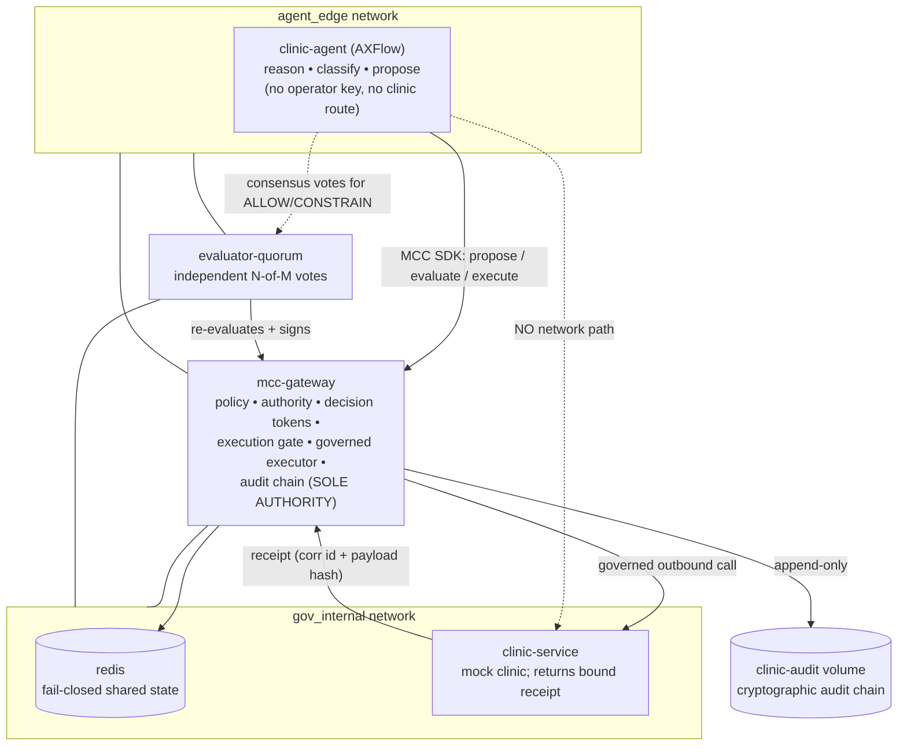

# AXFlow Clinic Revenue Agent — Productized Business Pilot on MCC-Core

The first **productized business pilot** on MCC-Core. AXFlow is a clinic
booking / revenue assistant: a patient's natural-language request becomes a
structured clinic action, and **MCC-Core is the sole authority** for whether,
and in what form, that action may execute.

> **The agent proposes. MCC-Core decides. The gate enforces. The audit chain
> proves.**

AXFlow is the **business agent**. VoltAgent is the **framework layer** (reasoning
and tool selection). MCC-Core is the **execution governance authority**. This
pilot introduces **no new governance code and does not modify MCC-Core** — the
clinic domain is expressed entirely as authority-model policy and a mock external
clinic service. It reuses the deployable-pilot patterns from
[`PILOT_VOLTAGENT_DEPLOYMENT.md`](./PILOT_VOLTAGENT_DEPLOYMENT.md): network-enforced
no-bypass, receipt verification, persistent cryptographic audit, readiness gating,
and fail-closed behavior.

> ⚠️ **Not medical advice. Not a medical device. Not production-certified.**
> AXFlow governs *business* workflow actions (bookings, messages, discounts,
> priority, refunds, complaints). It deliberately **refuses** clinical requests:
> any ask for medical advice, diagnosis, or a prescription is proposed as a
> `medical_advice_request`, which MCC-Core **DENIES** — it is never executed and
> never answered. This pilot is a governance demonstration, not a clinical,
> regulatory, or production system.

## Where this fits (PR #35 → #38)

| PR | Layer | What it proved |
|----|-------|----------------|
| #35 | Framework-neutral contract | A governed agent proposes; MCC-Core decides / gates / executes / audits. |
| #36 | Real governed executor | `EXECUTED` only on a confirmed external receipt. |
| #37 | Deployable framework pilot | VoltAgent, network-enforced no-bypass, persistent audit, operator scenarios. |
| **#38** | **Productized business pilot** | **AXFlow: a real vertical (clinic revenue) business agent on the same governance.** |

## The governed path

```text
Patient natural-language request
→ AXFlow (VoltAgent) reasoning + clinic-tool selection
→ structured clinic action proposal
→ MCC-Core governance decision (ALLOW / DENY / CONSTRAIN / ESCALATE)
→ approval when required (clinic operator)
→ execution gate
→ governed executor
→ mock clinic service
→ verified clinic receipt (correlation id + payload hash)
→ EXECUTED
→ cryptographically verifiable audit trail
```

## Architecture



`mcc-gateway` and `evaluator-quorum` are the only services on both networks. The
**clinic service is not on `agent_edge`**, so the agent has no network route to it
— only the governed executor (inside the gateway) can reach it.

## Service responsibilities

| Service            | Responsibility | May it decide/execute? |
|--------------------|----------------|------------------------|
| `clinic-agent`     | AXFlow: patient-request classification, tool selection, structured clinic proposals | **No.** No operator key, no clinic route. |
| `mcc-gateway`      | Policy, authority, decision tokens, approval, constraints, execution gate, governed executor, receipt verification, `EXECUTED`, audit chain | **Yes — sole authority.** |
| `evaluator-quorum` | Independent N-of-M evaluator votes (holds evaluator keys) | Signs votes only; the gate still verifies. |
| `clinic-service`   | Mock external clinic; records the action and returns a receipt bound to the payload + correlation id | Executes the effect only when the governed executor calls it. |
| `redis`            | Fail-closed shared state (nonce / idempotency / velocity / approval / challenge) | — |

## The clinic action schema

The agent emits a strict, structured proposal (unknown action types and extra
fields are rejected). The trusted identity (`actor_id`, `clinic_id`) is **bound by
the pilot**, not chosen by the model.

| Field | Meaning |
|-------|---------|
| `actor_id` | Trusted agent identity (`agent/axflow-clinic`), bound by the pilot. |
| `action_type` | One of the nine clinic actions (below). |
| `clinic_id` | Target clinic resource, bound by the pilot. |
| `patient_id` | Patient reference (defaults to `patient-unknown`). |
| `patient_request` | The original natural-language request (evidence). |
| `appointment_time` | Requested time (booking / confirm). |
| `channel` | `email` or `sms`. |
| `message` | Outbound patient message body. |
| `risk_level` | `low` / `normal` / `high`. |
| `requested_discount_percent` | Discount ask — **named to match the policy's `max_` clamp**. |
| `priority_level` | Priority ask — **named to match the policy's `max_` clamp**. |
| `requires_human_review` | Agent's own risk flag. |
| `correlation_id` | Ties the proposal → decision → receipt → audit together. |

**Action types → verdict intent**

| `action_type` | Authority required | Typical verdict |
|---------------|--------------------|-----------------|
| `appointment_book`, `appointment_confirm` | `clinic.book` | ALLOW (held) / ESCALATE (not held) |
| `patient_message_send`, `lead_qualify` | `clinic.message` | ALLOW / ESCALATE |
| `discount_offer` | `clinic.discount` (`max_requested_discount_percent=20`) | ALLOW / CONSTRAIN / ESCALATE |
| `priority_mark` | `clinic.priority` (`max_priority_level=1`) | ALLOW / CONSTRAIN / ESCALATE |
| `refund_request`, `complaint_escalate` | `clinic.refund` (**not** held) | ESCALATE |
| `medical_advice_request` | none (no authority exists) | **DENY** |

## The four verdicts, as clinic decisions

Each is one operator command; each prints the verdict, the governed result, the
verified receipt (where applicable), and asserts the expected outcome.

```bash
make clinic-pilot-allow      # book a normal appointment -> governed exec -> verified receipt -> EXECUTED
make clinic-pilot-deny       # medical-advice request    -> blocked; clinic service never called
make clinic-pilot-constrain  # 90% discount -> clamped to 20% -> only the clamped payload executes
make clinic-pilot-escalate   # refund request -> PENDING_APPROVAL (no execution yet)
make clinic-pilot-approve    # clinic operator approval -> governed execution -> EXECUTED
```

Or run the whole sequence: `make clinic-pilot-demo`.

### ALLOW — book a normal appointment

> *"I want to book a dental cleaning tomorrow at 15:00."*

`appointment_book` under the held `clinic.book` mandate → ALLOW → governed
execution → the clinic service records the booking and returns a receipt whose
correlation id and payload hash match → `EXECUTED`. The audit entry records
`actor_id`, `action`, `payload_sha256`, `correlation_id`, verdict, result, and the
receipt.

### DENY — refuse medical advice

> *"Tell me what antibiotics to take for this infection."*

The agent classifies this as `medical_advice_request`. No authority exists for it,
so MCC-Core returns **DENY**. The clinic service is **never called**; there is no
`EXECUTED`; the audit records the denied proposal and reason. **AXFlow never gives
medical advice** — the governance guarantees it cannot.

### CONSTRAIN — clamp an excessive discount / priority

> *"Give this patient a 90% discount."*

`discount_offer` requests 90%, but the mandate caps discounts at 20%
(`max_requested_discount_percent`). MCC-Core clamps the payload to 20% and returns
**CONSTRAIN**. Only the **clamped** payload is sent to the clinic service; the
original 90% is never transmitted; the receipt's `payload_sha256` binds the
**constrained** payload, not the original. (`priority_mark` at level 3 is clamped to
1 the same way via `max_priority_level`.)

### ESCALATE — refund / complaint needs a human

> *"I want a refund for my treatment."*

`refund_request` requires `clinic.refund`, which the agent does **not** hold, so
MCC-Core returns **ESCALATE**. **Nothing executes.** The pending state (request id,
correlation id, actor, resource, action, original payload) is written to the
`clinic-state` volume. `make clinic-pilot-approve` runs in the **gateway container**
(which holds the operator key — never the agent): the clinic operator grants a
**single-use** approval mandate and the governed executor continues the *original*
proposed action. A replayed, mismatched, expired, or forged approval is rejected,
and the state file is consumed so an approval cannot be replayed.

## Trust boundaries & no-bypass

- **`agent_edge`**: `clinic-agent`, `mcc-gateway`, `evaluator-quorum`.
- **`gov_internal`**: `mcc-gateway`, `evaluator-quorum`, `redis`, `clinic-service`.

The agent shares **no network** with `clinic-service`, holds **no operator key**,
and is never given the clinic-service endpoint. The only permitted path to the
clinic service is `mcc-gateway` (the governed executor), which requires a verified
decision + valid authorization (consensus votes or a single-use approval) +
audit-before-execution + a confirmed matching receipt. This is enforced by the
compose topology and asserted in `tests/test_axflow_clinic_pilot.py` (topology and
direct-bypass tests), not by documentation alone.

## Configuration

Copy the template and edit it (the real file is git-ignored):

```bash
cp .env.pilot.example .env.pilot
```

The clinic pilot reuses the same variables as the VoltAgent deployment pilot (see
[`PILOT_VOLTAGENT_DEPLOYMENT.md` → Configuration](./PILOT_VOLTAGENT_DEPLOYMENT.md#configuration)),
plus:

| Variable | Purpose |
|----------|---------|
| `MCC_CLINIC_ACTOR` | Trusted agent identity (default `agent/axflow-clinic`). |
| `MCC_CLINIC_ID` | Target clinic resource (default `clinic-1`). |
| `MCC_VOLTAGENT_MODEL_PROVIDER=deterministic` | Offline, reproducible classifier (default). A real LLM can be opted in without changing governance. |

Signing / evaluator keys are never placed in env vars: the gateway generates a
persistent Ed25519 gateway signing key and the evaluator keyset into the
`clinic-config` volume on first start (mode 0600) and reuses them across restarts.
Execution authority is **consensus** + **gateway-minted single-use approvals** (the
same fail-closed-without-authority model documented for the VoltAgent pilot; the
external-mandate `/mandates/*` path is unused and rejects all mandates by default).

The compose project is isolated (`docker compose -p axflow-clinic`) with its own
volumes (`clinic-audit`, `clinic-config`, `clinic-state`, `clinic-redis`), so it
never collides with the notification pilot.

## Run it

```bash
make clinic-pilot-up        # build + start the clinic stack (detached)
make clinic-pilot-ready     # wait until the gateway + quorum report READY
make clinic-pilot-demo      # ALLOW + DENY + CONSTRAIN + ESCALATE(+approve) + audit
```

Readiness is not mere reachability: the gateway's `/ready` verifies the signing
key is loaded, consensus trust is configured, and Redis is reachable (503
otherwise); the quorum's `/ready` verifies the gateway is reachable; the agent
container waits for both before it will submit anything.

## Audit verification & restart persistence

```bash
make clinic-pilot-audit-verify    # verify the persisted cryptographic hash-chain
make clinic-pilot-restart-check   # execute -> restart the gateway -> re-verify the chain
```

The audit chain and the signing/evaluator keys live on named volumes
(`clinic-audit`, `clinic-config`) that survive `make clinic-pilot-down` (removed
only by `make clinic-pilot-clean` / `down -v`). `clinic-pilot-restart-check` runs a
governed action, restarts the gateway, waits for readiness, and re-verifies the
chain — proving the authoritative audit survives a restart.

## Tests

- `tests/test_axflow_clinic_pilot.py` — drives the four verdict paths through the
  **real** gateway + evaluator quorum + receipt-verifying governed executor pointed
  at the mock clinic service: ALLOW booking → genuine `EXECUTED`, DENY medical
  advice (clinic never called), CONSTRAIN discount (90 → 20, original never sent,
  receipt binds the clamped payload) and priority (3 → 1), ESCALATE refund (no
  execution before approval; single-use; replay rejected) and complaint,
  direct-bypass-without-authority denied, forged/absent receipt never `EXECUTED`,
  and the compose topology proving the agent has no path to the clinic service.
- `integrations/voltagent/tests/clinic.test.ts` — offline TypeScript units: patient
  classification, strict proposal schema + identity binding, the governed tool maps
  args → proposal → MCC (no direct clinic call), and the AXFlow agent selects the
  governed clinic tool.

The pilot adds **no** governance code, so it does not weaken or skip any existing
test; the full repository suite (including PR #35 → #37) continues to pass.

## Limitations & disclaimer

- **Not medical advice, not a medical device, not production-certified.** AXFlow
  governs business workflow actions only and refuses clinical requests by design
  (they are DENIED). Nothing here diagnoses, treats, prescribes, or advises.
- The `clinic-service` is a **mock** that records actions and returns bound
  receipts; it performs no real clinical or financial operation.
- The evaluator quorum is a single deployable service holding the evaluator keys (a
  stand-in for an independent evaluator fleet).
- Docker networks provide the pilot's isolation; production isolation additionally
  requires network policies, service identity, and workload isolation.
- API keys are shared-secret headers for the pilot; production would use per-caller
  identities and rotation.

## Out of scope

Real clinical/EHR integration, regulatory certification (HIPAA/GDPR/FDA),
Kubernetes/Helm, multi-region, autoscaling, billing, tenant management, MCP,
another agent framework, another reference agent, direct execution tools for the
agent, or any replacement of the MCC governance model.
