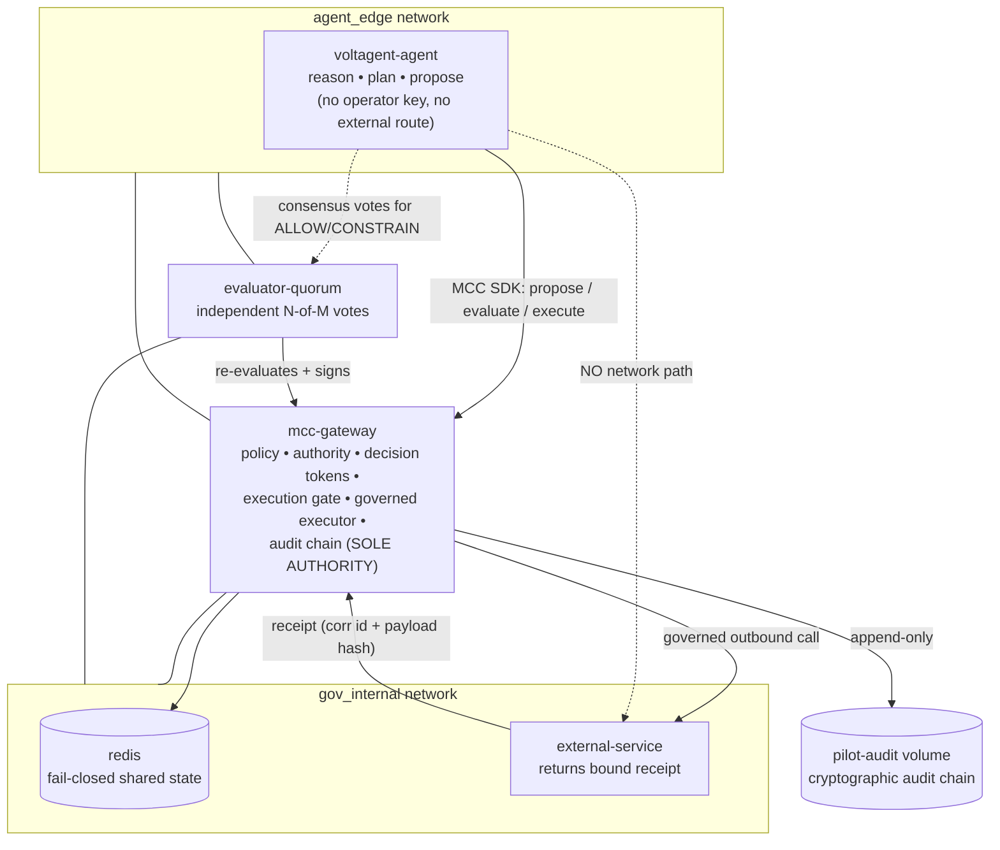

# Deployable Production Pilot — VoltAgent + MCC-Core

A reproducible, production-style pilot that proves a real third-party agent
framework (VoltAgent) can reason, plan, select tools, and generate structured
action proposals **while MCC-Core remains the sole governance and execution
authority**.

> VoltAgent proposes actions.
> MCC-Core decides whether they are authorized.
> The governed executor performs authorized actions.
> The external receipt proves the result.
> The audit chain records the complete governed path.

> **The model proposes. MCC decides. The gate enforces. The audit chain records.**

This is a deployable pilot, not a full commercial product. See
[Out of scope](#out-of-scope).

> **Filename note:** the compose file is `docker-compose.pilot-voltagent.yml`
> (the repo already has a different egress-proxy pilot at
> `docker-compose.pilot.yml`; the two are kept separate).

## Objective

Deploy the existing VoltAgent + MCC-Core integration as a production-style stack
and demonstrate the complete governed path for all four verdicts, with persistent
cryptographic audit, health/readiness gating, network-enforced bypass prevention,
and operator-run demonstration commands.

```text
Natural-language request
→ VoltAgent reasoning + tool selection
→ structured action proposal
→ MCC-Core governance decision (ALLOW / DENY / ESCALATE / CONSTRAIN)
→ approval when required
→ execution gate
→ governed executor
→ controlled external service
→ verified external receipt
→ EXECUTED
→ cryptographically verifiable audit trail
```

## Architecture



`mcc-gateway` and `evaluator-quorum` are the only services on both networks. The
**external service is not on `agent_edge`**, so the agent has no network route to
it — only the governed executor (inside the gateway) can reach it.

## Service responsibilities

| Service            | Responsibility | May it decide/execute? |
|--------------------|----------------|------------------------|
| `voltagent-agent`  | Reasoning, planning, tool selection, structured proposals | **No.** No operator key, no external route. |
| `mcc-gateway`      | Policy, authority, decision tokens, approval, constraints, execution gate, governed executor, receipt verification, `EXECUTED`, audit chain | **Yes — sole authority.** |
| `evaluator-quorum` | Independent N-of-M evaluator votes (holds evaluator keys) | Signs votes only; the gate still verifies. |
| `external-service` | Controlled external pilot service; returns a receipt bound to the payload + correlation id | Executes the effect only when the governed executor calls it. |
| `redis`            | Fail-closed shared state (nonce / idempotency / velocity / approval / challenge) | — |

## Trust boundaries & network isolation

- **`agent_edge`**: `voltagent-agent`, `mcc-gateway`, `evaluator-quorum`.
- **`gov_internal`**: `mcc-gateway`, `evaluator-quorum`, `redis`, `external-service`.

The agent shares **no network** with `external-service`. The only permitted path
to the external service is `mcc-gateway` (the governed executor), which requires a
verified decision + valid authorization + audit-before-execution + a confirmed
receipt. This is enforced by the compose topology and asserted in
`tests/test_pilot_deployment.py`, not by documentation alone.

## Configuration

Copy the template and edit it (the real file is git-ignored):

```bash
cp .env.pilot.example .env.pilot
```

| Variable | Purpose |
|----------|---------|
| `MCC_GATEWAY_API_KEY` | Agent key (propose / evaluate / governed execute). |
| `MCC_GATEWAY_OPERATOR_API_KEY` | Operator key (approve/deny). Held only by the operator context; empty disables operator actions (fail-closed). |
| `MCC_VOLTAGENT_MODEL_PROVIDER` / `MCC_VOLTAGENT_MODEL` | Model provider; `deterministic` (default, offline) or an explicit opt-in provider (e.g. `openai` + `OPENAI_API_KEY`). |
| `MCC_VOLTAGENT_ACTOR` / `MCC_VOLTAGENT_RESOURCE` | Trusted proposal identity (not model-chosen). |
| `MCC_GATEWAY_URL` / `MCC_QUORUM_URL` / `MCC_REDIS_URL` / `MCC_UPSTREAM_BASE` | Endpoints. |
| `MCC_GATEWAY_MODE=inline` | Enforce verdicts (never `observe` in the pilot). |
| `MCC_REDIS_NAMESPACE=pilot` | Redis **key isolation only** (grants no authority — see below). |
| `MCC_CONSENSUS_THRESHOLD` | N-of-M consensus threshold. |
| `MCC_UPSTREAM_RECEIPT_VERIFY=1` | `EXECUTED` only on a confirmed matching receipt. |
| `MCC_GATEWAY_AUDIT_LOG_PATH` | Persistent audit chain path (mounted volume). |

**Signing / evaluator keys** are never placed in env vars: the gateway generates a
persistent Ed25519 **gateway signing key** and the **evaluator keyset** into the
`pilot-config` volume on first start (mode 0600), and reuses them across restarts.

### Secrets & fail-closed guarantees

- No secrets are committed; `.env.pilot` and `*.pem` are git-ignored.
- Redis-backed state with **no silent fallback** to in-memory (a Redis outage
  fails closed — enforced by `MCC_*_BACKEND=redis`, independent of `MCC_ENV`).
- Persistent audit with no fallback to disposable logging (audit-before-execution
  is a hard precondition; logs are never the authoritative record).
- No environment variable disables governance in the pilot profile; the pilot test
  suite asserts `inline` mode + Redis backends.

### Why not `MCC_ENV=pilot` / mandate trust?

`MCC_ENV=pilot` gates exactly two things: (1) it requires `MCC_TRUST_CONFIG` — the
**external-mandate** multi-issuer trust set used only on the `/mandates/*` path;
and (2) a Redis-namespace fallback. This pilot's execution authority is
**consensus** (evaluator trust, configured via `MCC_CONSENSUS_TRUST_CONFIG`) and
**gateway-minted single-use approvals** (verified against the runtime approver
key). It never uses the external-mandate path, so the mandate-trust requirement is
not applicable. With no `MCC_TRUST_CONFIG` the external-mandate trust set is empty,
so `/mandates/execute` **rejects all** external mandates — strictly fail-closed,
not weaker. `MCC_REDIS_NAMESPACE=pilot` provides Redis key isolation **only** and
grants no authority. `tests/test_pilot_deployment.py` proves the deployment fails
closed without valid execution authority (no votes, forged votes, forged approval
mandate, untrusted external mandate all fail to execute).

## Startup & readiness

```bash
make pilot-up      # build + start (detached)
make pilot-ready   # wait until the gateway + quorum report READY
```

Readiness is not mere reachability: `mcc-gateway`'s `/ready` verifies the signing
key is loaded, the consensus trust is configured, and Redis is reachable (503
otherwise); `evaluator-quorum`'s `/ready` verifies the gateway is reachable; the
agent container waits for both before it will submit anything.

## Demonstration scenarios

Each is one operator command; each prints the verdict, the governed result, the
verified receipt (where applicable), and asserts the expected governance outcome.

```bash
make pilot-allow      # ALLOW      -> governed execution -> verified receipt -> EXECUTED
make pilot-deny       # DENY       -> blocked; external service never called
make pilot-constrain  # CONSTRAIN  -> only the clamped payload (priority 9 -> 3) executes
make pilot-escalate   # ESCALATE   -> PENDING_APPROVAL (no execution yet)
make pilot-approve    # operator approval -> governed execution -> EXECUTED
```

Or run the whole sequence: `make pilot-demo`.

### Approval flow (ESCALATE)

1. `make pilot-escalate` — the agent proposes as an actor with no mandate; MCC
   returns `ESCALATE`; **nothing executes**. The pending state (request id,
   correlation id, actor, resource, original payload) is recorded to the
   `pilot-state` volume.
2. `make pilot-approve` — the **operator** (running in the gateway container, which
   holds the operator key — never the agent) grants a single-use approval mandate
   and continues the governed execution of the *original* proposed action. A
   mismatched, expired, or forged approval is rejected; the state file is consumed
   so an approval cannot be replayed.

### Receipt verification

The governed executor performs a real HTTP call to `external-service`, which
returns a receipt containing the correlation id, a payload hash, a receipt id, and
the result. `EXECUTED` is issued **only** when the receipt confirms delivery and
its correlation id + payload hash match the executed payload. A forged, mismatched,
or absent receipt fails closed (never `EXECUTED`).

### Audit verification & restart persistence

```bash
make pilot-audit-verify    # verify the persisted cryptographic hash-chain
make pilot-restart-check   # execute -> restart the gateway -> re-verify the chain
```

The audit chain and the signing/evaluator keys live on named volumes
(`pilot-audit`, `pilot-config`) that survive `make pilot-down` (removed only by
`make pilot-clean` / `down -v`). `pilot-restart-check` runs a governed action,
restarts the gateway, waits for readiness, and re-verifies the chain — proving the
authoritative audit survives a restart.

## Failure modes (fail-closed)

The pilot preserves every MCC-Core invariant. Fail-closed behavior is covered by
`tests/test_pilot_deployment.py` (deployment-level) plus the repository suites it
references: `tests/test_mcc_core.py`, `tests/test_consensus_enforcement.py`,
`tests/test_governed_executor_pilot.py`, `tests/test_voltagent_quorum.py`, and the
TypeScript suite under `integrations/voltagent/tests/`. Together they cover: agent
bypass attempts, direct external access rejected, forged/mismatched/wrong-payload
receipts, replayed decision tokens/approvals, expired authorization, invalid
signature / wrong audience / actor / resource / action-hash / policy-hash mismatch,
Redis unavailable, audit-before-execution unavailable, execution before/after
approval, and approval for a different proposal. In every case: no unauthorized
external action, no invalid receipt accepted, no incorrect `EXECUTED`, and the
failure is recorded when audit recording remains available.

## Troubleshooting

| Symptom | Likely cause / fix |
|---------|--------------------|
| `make pilot-ready` times out | A dependency is unhealthy. `make pilot-ps` / `make pilot-logs`; check Redis and the gateway `/ready`. |
| `pilot-approve` says "no pending escalation" | Run `make pilot-escalate` first (it records the state file). |
| Scenario exits non-zero | The governance outcome did not match the expectation — read the printed verdict/reason. |
| Gateway `/ready` returns 503 | Redis unreachable or signing key/trust not loaded (fail-closed by design). |
| Want a real LLM | Set `MCC_VOLTAGENT_MODEL_PROVIDER=openai`, `MCC_VOLTAGENT_MODEL=…`, `OPENAI_API_KEY=…` in `.env.pilot`. Governance is unaffected. |

## How to demo this to a design partner (≈10–15 min)

1. **Show the trust boundary.** Open the architecture diagram and point out that
   the agent has no network path to the external service, no operator key, and no
   execution authority. `make pilot-up && make pilot-ready`.
2. **Normal request → ALLOW.** `make pilot-allow`. A reasoned proposal is
   authorized, executed through the governed executor, and returns a verified
   receipt and `EXECUTED`.
3. **Prohibited request → DENY.** `make pilot-deny`. The action is blocked; the
   external service is never called; no `EXECUTED`.
4. **Excessive request → CONSTRAIN.** `make pilot-constrain`. MCC clamps the
   payload; only the constrained action is executed; the receipt is bound to the
   clamped payload.
5. **High-risk request → ESCALATE + approval.** `make pilot-escalate` (pauses,
   nothing runs) then `make pilot-approve` (operator authorizes → executes).
6. **Show the verified receipt + `EXECUTED`.** Point at the receipt (correlation id
   + payload hash) printed by the scenarios.
7. **Show the audit trail + no bypass.** `make pilot-audit-verify` and
   `make pilot-restart-check`. The audit chain is independently verifiable and
   survives a restart; there is no bypass path around MCC-Core.

Business value: the agent can reason and propose; MCC-Core controls authority;
execution is policy-bound; approvals are enforceable; external results are
verifiable; the audit trail is independently checkable.

## Security limitations

- The evaluator quorum is a single deployable service holding the evaluator keys
  (a stand-in for an independent evaluator fleet); it re-evaluates against the
  gateway and only votes for executable decisions.
- Docker networks provide the pilot's isolation. Production isolation additionally
  requires network policies, service identity, and workload isolation.
- API keys are shared-secret headers for the pilot; a production deployment would
  use per-caller identities and rotation.
- The governed executor is embedded in the gateway (a single enforcement path by
  design); splitting it would fragment enforcement.

## Out of scope

Kubernetes, Helm, multi-region, autoscaling, service mesh, tenant management,
billing, customer workflows, cloud provisioning, SOC 2 / ISO 27001, unrelated UI,
MCP, another agent framework, another reference agent, direct execution tools for
VoltAgent, or any replacement of the MCC governance model.
