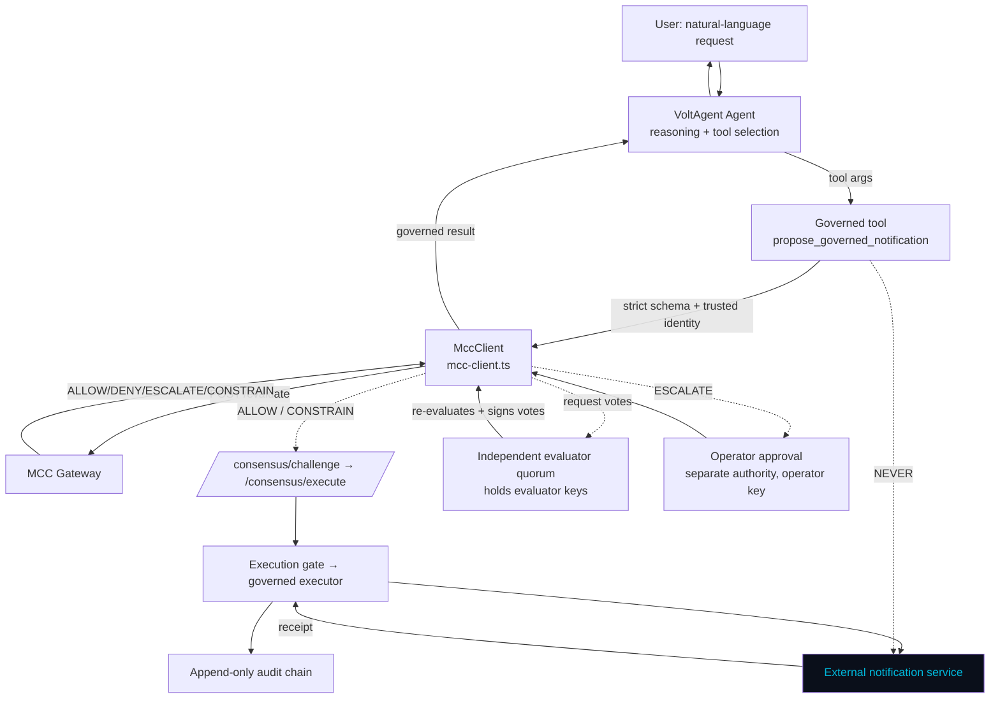

# Real VoltAgent Governed Integration

The first **real third-party agent-framework integration** for MCC-Core.

> **VoltAgent provides agent reasoning and orchestration. MCC-Core provides
> verified execution governance.**

[VoltAgent](https://voltagent.dev) (a TypeScript AI agent framework) handles
reasoning, instruction-following, orchestration, and tool selection. MCC-Core
remains the **sole** authority for governance evaluation, identity/authority
verification, the four verdicts, approval, execution authorization and gating,
governed external execution, receipt verification, `EXECUTED` status, and
append-only audit evidence.

This integration reuses the framework-neutral contract from PR #35 — it does not
implement MCP, and it does not turn MCC-Core into a VoltAgent-specific system.

## What VoltAgent controls vs. what MCC-Core controls

| VoltAgent (this package)                     | MCC-Core (unchanged runtime)                        |
| -------------------------------------------- | --------------------------------------------------- |
| Interpret the natural-language request       | Evaluate the proposal → ALLOW/DENY/ESCALATE/CONSTRAIN |
| Select the governed tool                     | Verify identity + authority                          |
| Fill the notification *content*              | Approval when required (operator, single-use mandate) |
| Submit the proposal via the MCC client       | Execution authorization (N-of-M consensus / mandate)  |
| Report the governed result honestly          | Execution gate + governed executor + receipt verify   |
|                                              | `EXECUTED` only on a confirmed receipt + audit chain  |

**The agent has no direct execution authority.** It holds no notification-service
client, no operator key, and no execution path of its own. Every side effect flows:

```
Natural-language request
  → VoltAgent (reasoning + tool selection)
  → structured action proposal (strict schema)
  → MCC-Core integration contract (mcc-client.ts)
  → governance decision (ALLOW / DENY / ESCALATE / CONSTRAIN)
  → approval when required
  → execution gate
  → governed executor
  → external notification service
  → verified external receipt
  → EXECUTED
  → verifiable audit trail
```

No verified authority — no execution. No verified external receipt — no `EXECUTED`.

## Architecture



The VoltAgent agent never reaches the external service directly (dotted line). The
independent evaluator quorum holds the evaluator keys and only signs votes for an
**executable** decision, over the gateway's own authoritative payload — VoltAgent
holds no key and cannot forge a vote. Selecting the tool is not permission.

## Verdict behavior

| Verdict     | What happens                                                                      |
| ----------- | --------------------------------------------------------------------------------- |
| `ALLOW`     | Governed consensus execution → verified receipt → `EXECUTED`.                      |
| `DENY`      | Blocked. The notification service is never called. No `EXECUTED`.                 |
| `ESCALATE`  | `PENDING_APPROVAL`; no execution until a separate operator grants a single-use mandate, then governed execution proceeds. |
| `CONSTRAIN` | Only the **clamped** payload (e.g. priority 9 → 3) is bound to the authorization and sent; the receipt + audit correspond to the clamped payload. |

**Receipt verification.** `EXECUTED` is returned only after MCC-Core's governed
executor performs the outbound call and the external service returns a receipt
whose `correlation_id` and payload hash match the executed payload. A forged,
mismatched, or absent receipt fails closed — the action is not `EXECUTED`.

**Bypass prevention.** The agent's client is built without an operator key, so it
can never approve its own escalations; it knows only the gateway and quorum URLs,
never the notification service; a static test (`tests/no-bypass.test.ts`) enforces
that no module except the MCC client performs network calls, and that the client
contains no notification-service endpoint.

## Install & run

```bash
cd integrations/voltagent
npm ci                      # reproducible install (committed lockfile)
```

### Provider configuration

The LLM provider is not hard-coded. By default the integration uses a
**deterministic offline model** (no API key, reproducible) so the demo, tests, and
Docker E2E run with no paid API. To use a real provider:

```bash
export MCC_VOLTAGENT_MODEL_PROVIDER=openai
export MCC_VOLTAGENT_MODEL=gpt-4o-mini
export OPENAI_API_KEY=sk-...
```

MCC-Core governance is entirely independent of the model — the model only chooses
what to *propose*.

### Local demo (against a running gateway + quorum)

```bash
export MCC_GATEWAY_URL=http://127.0.0.1:8001 MCC_QUORUM_URL=http://127.0.0.1:8080
export MCC_GATEWAY_API_KEY=demo-key
npm run demo -- "Send a confirmation to customer-123 that their order has been approved"
```

### One-command full stack (Docker Compose)

```bash
# from the repository root
docker compose -f docker-compose.voltagent.yml up --build \
    --abort-on-container-exit --exit-code-from voltagent-agent
```

This starts redis + the mock notification service + the MCC gateway (consensus +
receipt-verifying executor) + the independent evaluator quorum + the real
VoltAgent agent, and runs the end-to-end demonstration of all four verdicts and a
genuine `EXECUTED` result. Teardown:

```bash
docker compose -f docker-compose.voltagent.yml down -v
```

## Tests

```bash
npm run check      # Biome format + lint
npm run typecheck  # tsc --strict
npm test           # vitest: unit + integration (spawns the REAL MCC stack)
```

The vitest suite starts the real MCC governed stack in-process (gateway +
evaluator quorum + mock service) via a Python launcher, so the four verdicts,
constrained-payload binding, correlation propagation, replay/duplicate prevention,
and fail-closed behavior are exercised against genuine governance — not a mock.
Set `MCC_SKIP_INTEGRATION=1` to run only the offline unit tests.

Complementary Python integration tests live at
`tests/test_voltagent_quorum.py` (evaluator quorum + genuine EXECUTED + forged
receipt + replay against the real gateway).

## Package layout

| Path                              | Responsibility                                                        |
| --------------------------------- | -------------------------------------------------------------------- |
| `src/schemas.ts`                  | Strict zod proposal schema + trusted-identity binding.               |
| `src/mcc-client.ts`               | The MCC gateway contract client + governed-path orchestration.       |
| `src/tools/governed-notification.ts` | The single governed VoltAgent tool.                               |
| `src/model.ts`                    | Provider config + deterministic offline model.                       |
| `src/agent.ts`                    | The VoltAgent agent wiring (operator-less client).                   |
| `src/demo.ts` / `src/e2e-runner.ts` | Runnable NL demo + Docker E2E runner.                              |
| `mcc_side/evaluator_quorum.py`    | Independent evaluator quorum (holds keys; signs only executable).    |
| `mcc_side/generate_config.py`     | Evaluator keyset → public trust config + private keys.               |
| `mcc_side/testserver.py`          | In-process real MCC stack for the vitest integration tests.          |
| `docker/` + `../../docker-compose.voltagent.yml` | The full container stack.                            |

VoltAgent, LangGraph, CrewAI, and other frameworks integrate through this same SDK
boundary — MCC-Core does not need to know which framework is proposing. This PR
proves the contract against VoltAgent specifically.
